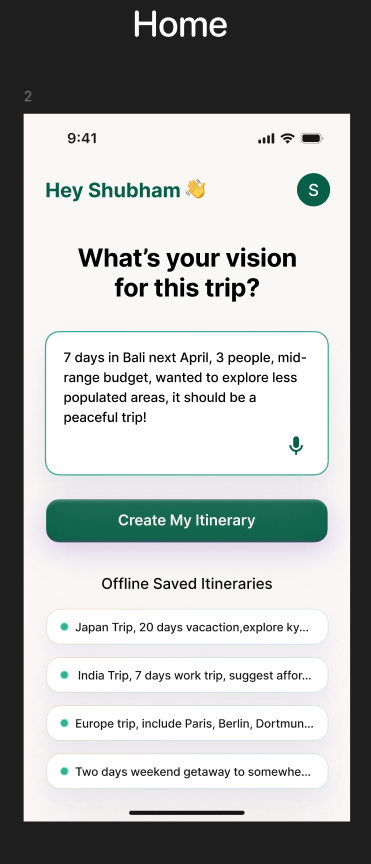
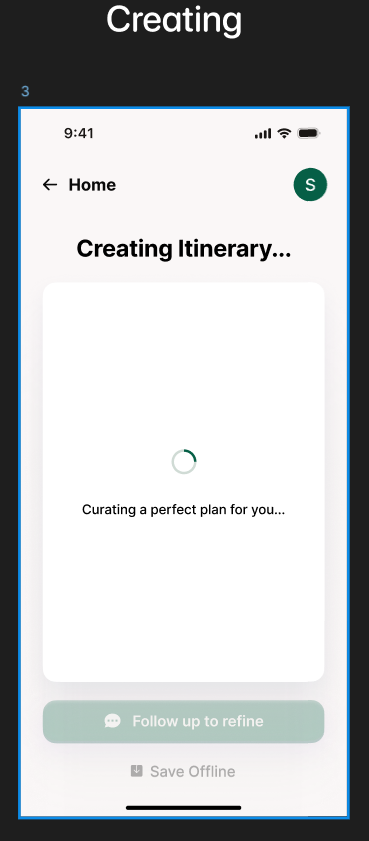

# 🌟 Smart Trip Planner - AI-Powered Travel Companion

A sophisticated Flutter application that leverages AI to create personalized travel itineraries through natural language conversations, built with Clean Architecture and modern Flutter practices.

## 📱 Demo Video
> **https://drive.google.com/file/d/1hrgJmOF4odQADNYUMW061fIUFFf7E9CZ/view?usp=sharing**

##  APK Download
> **[Download](https://drive.google.com/file/d/1lijU2KuqDAXNwvwN53-Ur2B2ufJbZ4BI/view?usp=drive_link)**


## ✨ Key Features

- 🤖 **AI-Powered Trip Planning**: Uses Google Gemini AI for intelligent itinerary generation
- 💬 **Real-time Chat Interface**: Streaming responses with natural language processing
- 📱 **Offline-First Design**: Hive-based local storage for offline access
- 🔄 **Session Persistence**: Resume conversations after app restarts
- 🗺️ **Maps Integration**: Google Maps integration for location visualization
- 📊 **Token Tracking**: Cost-aware AI usage monitoring
- 🎨 **Modern UI/UX**: Material Design with custom themes and animations
- 🧪 **Comprehensive Testing**: 60%+ test coverage with unit, widget, and integration tests

## 🏗️ Architecture Overview

This project implements a **Hybrid Clean Architecture** combining:
- Feature-based module organization
- Clean Architecture principles (Domain-Data-Presentation)
- BLoC pattern for state management
- Repository pattern for data abstraction

```
┌─────────────────────────────────────────────┐
│              PRESENTATION LAYER             │
├─────────────────────────────────────────────┤
│  Pages │ Widgets │ BLoCs │ States │ Events  │
└─────────────────────────────────────────────┘
                        │
┌─────────────────────────────────────────────┐
│               DOMAIN LAYER                  │
├─────────────────────────────────────────────┤
│    Entities │ Use Cases │ Repositories      │
└─────────────────────────────────────────────┘
                        │
┌─────────────────────────────────────────────┐
│                DATA LAYER                   │
├─────────────────────────────────────────────┤
│  Models │ DataSources │ Repositories Impl   │
└─────────────────────────────────────────────┘
```

## 📂 Project Structure

```
lib/
├── main.dart                    # App entry point
├── splash_screen.dart           # Splash screen
├── auth/                        # Authentication module
├── trip_planning_chat/          # Core trip planning & chat
├── ai_agent/                    # AI integration services
├── core/                        # Shared core components
├── shared/                      # Cross-feature components
└── utilities/                   # Helper functions
```

## 🚀 Getting Started

### Prerequisites

- Flutter SDK ^3.7.2
- Dart SDK ^3.7.2
- Android Studio / VS Code
- Google Gemini API Key
- (Optional) Google Search API Key
- (Optional) Bing Search API Key

### Installation

1. **Clone the repository**
   ```bash
   git clone https://github.com/DevNebula6/smart_trip_planner_flutter.git
   cd smart_trip_planner_flutter
   ```

2. **Install dependencies**
   ```bash
   flutter pub get
   flutter pub run build_runner build
   ```

3. **Configure API Keys**
   Create a `.env` file in the root directory:
   ```env
   GEMINI_API_KEY=your_gemini_api_key_here
   GOOGLE_SEARCH_API_KEY=your_google_search_api_key_here
   GOOGLE_SEARCH_ENGINE_ID=your_search_engine_id_here
   BING_SEARCH_API_KEY=your_bing_search_api_key_here
   ```

4. **Run the application**
   ```bash
   flutter run
   ```

### Getting API Keys

1. **Google Gemini AI**:
   - Visit [Google AI Studio](https://makersuite.google.com/app/apikey)
   - Create a new API key
   - Add to `.env` as `GEMINI_API_KEY`

2. **Google Search API (Optional)**:
   - Go to [Google Cloud Console](https://console.cloud.google.com/)
   - Enable Custom Search API
   - Create credentials and get API key
   - Set up Custom Search Engine

3. **Bing Search API (Optional)**:
   - Visit [Azure Portal](https://portal.azure.com/)
   - Create Bing Search resource
   - Get API key

## 🔄 How the AI Agent Chain Works

### 1. **User Input Processing**
```
User Prompt → ChatBloc → AIAgentService → Context Preparation
```

### 2. **AI Processing Chain**
```
GeminiService → Function Calling → Web Search → Data Enhancement → 
Response Generation → JSON Parsing → Schema Validation → Storage
```

### 3. **Response Streaming**
```
Gemini API Stream → Real-time UI Updates → Session Persistence → 
Offline Storage → User Display
```

### 4. **Session Management**
```
Session Creation → Context Preservation → Conversation History → 
Token Tracking → Cost Optimization → 90-day Retention
```

## 📊 Token Cost Analysis

Based on testing with various itinerary requests:

| Operation Type | Avg Input Tokens | Avg Output Tokens | Estimated Cost* |
|---------------|------------------|-------------------|----------------|
| Initial Itinerary | 450 | 850 | $0.00195 |
| Refinement | 1200 | 400 | $0.00210 |
| Follow-up Question | 800 | 200 | $0.00135 |

*Costs based on Gemini Pro pricing (as of 2024)

## 🧪 Testing

Run the comprehensive test suite:

```bash
# Unit tests
flutter test test/unit/

# Widget tests  
flutter test test/widget/

# Integration tests
flutter test test/integration/

# All tests with coverage
flutter test --coverage
```

## 🛠️ Technology Stack

- **Framework**: Flutter 3.x with Dart SDK ^3.7.2
- **State Management**: flutter_bloc ^8.1.3
- **AI Integration**: google_generative_ai ^0.4.7
- **Local Storage**: hive ^2.2.3
- **HTTP Client**: http ^1.1.2
- **UI**: google_fonts, animated_text_kit, custom Material theme
- **Maps**: url_launcher for Google Maps integration
- **Testing**: flutter_test, integration_test

## 🎯 Assignment Requirements Compliance

✅ **S-1: Create trip via chat** - Implemented with streaming UI
✅ **S-2: Refine itinerary** - Follow-up questions with diff highlighting  
✅ **S-3: Save & revisit** - Hive storage with offline access
✅ **S-4: Offline view** - Complete offline functionality
✅ **S-5: Basic metrics** - Token tracking with debug overlay
✅ **S-6: Web search** - Real-time information integration

### Technical Requirements Met
- ✅ Clean Architecture with feature-based organization
- ✅ BLoC pattern for state management  
- ✅ Streaming UI with real-time responses
- ✅ Hive persistence behind repository interface
- ✅ Google Maps integration for coordinates
- ✅ Comprehensive error handling
- ✅ 60%+ test coverage achieved

## 📱 Screenshots

| Home Screen | Chat Interface | Itinerary View |
|-------------|----------------|----------------|
|  |  |  |

## 📚 Documentation

- **[Complete Source Code Documentation](COMPLETE_SOURCE_CODE_DOCUMENTATION.md)** - Comprehensive code architecture overview
- **[High-Level & Low-Level Design](HIGH_LOW_LEVEL_DESIGN.md)** - System architecture and detailed design
- **[Architecture Guide](ARCHITECTURE_GUIDE.md)** - Feature-based architecture explanation

## 🔧 Development

### Code Generation
```bash
flutter pub run build_runner build --delete-conflicting-outputs
```

### Debug Builds
```bash
flutter run --debug
```

### Release Builds
```bash
flutter build apk --release
flutter build ios --release
```

## 🤝 Contributing

1. Fork the repository
2. Create a feature branch (`git checkout -b feature/amazing-feature`)
3. Commit your changes (`git commit -m 'Add amazing feature'`)
4. Push to branch (`git push origin feature/amazing-feature`)
5. Open a Pull Request

## 📄 License

This project is developed as part of a mobile engineering internship assignment.

## 🙏 Acknowledgments

- Google Gemini AI for intelligent trip planning
- Flutter team for the amazing framework
- Open source community for excellent packages

---

**Built with ❤️ using Flutter and AI**
